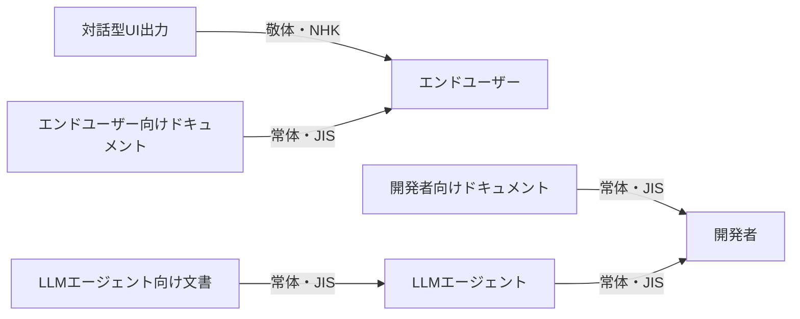

# 記述スタイル

コード・テストコード・ドキュメントなどあらゆる成果物の新規作成・修正・計画・レビュー時に、以下の方針に従う。

## 大原則

- 自然な日本語で書くことを最優先とする。
  以降の節は自然な日本語表現を支える具体策であり、機械的な禁止事項列挙ではない
- 観測事実ベースの記述を採用する。
  動作・状態・構造などを、観察すれば誰でも同じ結論に至る客観的・中立的な表現で書く
- 推奨形を先に思い浮かべ、当てはまらない場合に避ける表現を排除する順序で書く。
  禁止条件から発想すると不自然な言い換えに陥りやすい

## 文体の核

成果物の文体は **JIS規格・公的な標準仕様書のスタイル** に揃える。
語尾・漢語率・断定度・規範述語（「〜とする」「〜ものとする」「〜してはならない」「〜できる」）を
そのまま踏襲する。
前置き・自己紹介・書き手目線の解説は置かない。
ほぼ全ての成果物が本文体の対象となる。
対象例: README・利用ガイド・CHANGELOG・コミットメッセージ・PR説明・調査レポート・コード内コメント・
`CLAUDE.md`・`.claude/rules/`・`SKILL.md`・サブエージェント定義など。

例外として、対話型UI向け（敬体）の文章は **NHKの案内放送原稿のスタイル** に揃える。
敬体ベースで、原因と対処を一組にする穏やかな文体を採用する。

具体的な使い分けは「対象読者と文体」節を参照する。

### 媒体指定でも残りやすい癖

JIS規格スタイルを指定しても、LLMの出力には以下の癖が混入しやすい。意識的に排除する。

- 主観的修飾語を名詞句に付けない（程度や評価を主観で示す形容詞・形容動詞）
- 営業文書調・宣伝調のフレーズを使わない（特徴・理由・魅力を売り文句で要約する書き方）
- 程度副詞を技術文書に持ち込まない（強調や勧誘を意図する副詞）
- 比喩動詞を使わない（技術的な動作を観測動詞で記述できるのに、行為や物理動作の比喩で書く例）
- 具体例が必要な場合は`agent-toolkit:writing-standards`スキル経由で`references/tone-examples.md`を参照する

## 対象読者と文体

成果物には必ず対象読者がいる。読み手は**エンドユーザー・開発者・LLMエージェント**の3種類。
文体は対話型UI出力のみ**敬体・NHKスタイル**を採用し、それ以外は**常体・JIS規格スタイル**で揃える。

| 読み手 | 文書／出力の例 | 文体 |
| --- | --- | --- |
| エンドユーザー | 対話型UI（CLI案内・GUIダイアログ・エラー画面・通知） | 敬体・NHK |
| エンドユーザー | README・利用ガイド・`docs/guide/`配下 | 常体・JIS |
| 開発者 | アーキテクチャ・CONTRIBUTING・コードコメント | 常体・JIS |
| 開発者 | LLMエージェントの応答本文・拡張思考（thinking） | 常体・JIS |
| LLMエージェント | `CLAUDE.md`・`.claude/rules/`・`SKILL.md`・サブエージェント定義・hooks関連 | 常体・JIS |

各読み手に共通する想定知識と粒度は次の通り。

- エンドユーザー向け: 内部実装は知らない前提とし、専門用語は初出時に補足する
  - 対話型UI: 操作・状態・対処を端的に伝える。
    エラーは原因と対処を一組で示し、利用者が次の行動を判断できる情報量を保つ
  - エンドユーザー向けドキュメント:「何ができるか」「どう使うか」を中心に、利用者の操作目線で書く
- 開発者向け: プロジェクトの前提知識を共有する開発者を想定し、初歩の説明は省くが、コード識別子レベルの詳細は扱わない
  - 開発者向けドキュメント:「なぜそう設計したか」「どこに注意が必要か」を中心に書く
  - LLMエージェントの発話: ユーザーが進捗・選択判断・成果物の状況を把握できる情報量を保つ。
    拡張思考も日本語を使用する
- LLMエージェント向け: 前置き・自己紹介・書き手目線の解説は不要。
  判断に必要な情報のみを直接記述する。
  冗長な説明はトリガー精度の低下とコンテキスト消費を招く

個別注意:

- 1つのドキュメントが複数の読者層を対象にする場合はセクションを分け、各セクション内では文体と粒度を統一する
- コメント・ログメッセージ・ドキュメント・コミットメッセージなど全ての文章を日本語で書く（プロジェクト方針が無い場合）
- 対話型UI向けでも、LLMに直接渡るhook出力（`reason`・`additionalContext`・exit 2のstderr等）は
  プロジェクト方針で英語表記を固定する場合がある。
  Claude Code関連の出力先別の方針は`agent-toolkit:writing-standards`スキルの
  `references/claude-hooks.md`の「メッセージの記述言語」節に従う
- LLMエージェントの発話は応答本文・拡張思考がコンテキストへ残り後続生成の文体・言語へ影響するため、
  敬体や英語混在を避けて統制する

## 文章の書き方

「推奨表現と語彙」で肯定形を先に提示し、「行動指示の述部」と「構造と順序」を文章全体の組み立て方針として併せて適用する。

### 推奨表現と語彙

- 直接的で簡潔な書き言葉で一文一義に書く
- 断定的で安定した語尾を使う（常体では「〜する」「〜である」「〜となる」「〜とする」「〜ものとする」）
- 標準的な技術用語を使う
  - 例:「例外を送出する」「プロセスを終了する」「サーバーが停止する」「処理を呼び出す」
   「メモリーを解放する」「接続を確立する」「設定を読み込む」
- 処理・状態遷移・データ変更は技術的に観測できる事実を表す動詞で書く
  - 許容例:「実行する」「起動する」「上書きする」「置き換える」「無効化する」「書き込む」「読み込む」
- 名詞句はフラットに対象名詞のみで表記する
  - 許容例:「設定」「構成」
- 五段動詞の縮約形（能動形を1語に縮約した可能形で文を結ぶ書き方）は使わず、
  `〜することができる`形式または別の能動表現に置き換える
  - 推奨例（置き換え後）:「記述できる」「参照できる」「利用できる」「動作できる」

### 行動指示の述部

ユーザーへ行動を促す文（行動指示）と、状態・事実を述べる説明文では結びを使い分ける。
本方針はエンドユーザー向けドキュメント・開発者向けドキュメント（README・利用ガイド・docs配下など）を主対象とする。
LLMエージェント向け文書（`CLAUDE.md`・`.claude/rules/`・`SKILL.md`・サブエージェント定義など）は
エージェントへの直接指示として書くため、常体の指示終止形（「〜する」「〜を確認する」）を許容する。

- 行動指示は体言止めで結ぶ
  - 許容例:「〜を参照」「〜を指定」
  - 常体採用のエンドユーザー向けドキュメント・開発者向けドキュメントで行動指示を常体終止にすると不自然になるため避ける
- 敬体採用ドキュメント（対話型UIメッセージなど）では行動指示も敬体で結ぶ
  - 許容例:「〜を参照してください」
- 説明文の常体終止は維持する
  - 許容例:「〜となる」「〜である」
  - 本方針は行動指示の述部に限定する

### 構造と順序

- トップダウン（段階的詳細化）: 全体の構造から徐々に詳細に掘り下げる（考慮漏れを避けるため）
  - ソースコードでは、型定義や上位の関数から先に書き、下位に掘り下げる。関数Aから関数Bを呼び出す場合、Aを前にBを後ろに定義する
  - ドキュメントでは、全体の構成やセクションの見出しから書き始め、徐々に肉付けする
  - 以上を満たす範囲内で、関連するものは近くにまとめる
  - 追記時も定義順に注意し、むやみに末尾に追加してはならない
- 文章の並びは粒度を揃える。急に粒度の違う話を書かない（追記時には特に注意）
  - 追記する内容が対象個所の記述粒度と整合しているか必ず確認し、必要に応じて既存部分や章構成の変更も含め自然な記述を保つ
  - 一段詳細な話を続けるときは「例えば」などの接続表現を付けて唐突感を回避する

## 日本語の表記ルール

プロジェクト方針が無い場合の方針（JTF日本語標準スタイルガイドおよびJIS Z 8301:2019を参考）。

- 原則としてJTF日本語標準スタイルガイドに準拠する。textlintの`preset-jtf-style`で検査される項目はそちらに従う
- 日本語と全角括弧の境界にスペースを挿入しない（例: `設定ファイル（既定値あり）`）
- 英文脈の半角括弧は英数字との間にスペース1つ（例: `Python (CPython 3.12)`）
- 頻出違反のため特に意識するtextlint規則:
  - 日本語と半角文字（英数字・記号・インラインコード）が隣接する場合、間にスペースを挿入しない（JTF 3.1.1）
    - 例: `Pythonの設定`、`chezmoiで管理する`、「`uv add`を使う」
  - 和文中にハイフン`-`を使わない（JTF 4.2.6）。接頭辞名や識別子はインラインコード内に含める
  - 半角括弧`()`を日本語本文に使わない。代わりに全角の`（）`を使う（JTF 4.3.1）
  - かっこ類と隣接する文字の間のスペース（JTF 3.3）は、
    改行折り返しで全角括弧が行頭に位置した場合も違反と判定されることがある。
    当該句を前文末へ統合するか、改行位置を変更して回避する
    - Markdown箇条書きの継続行（2行目以降）で全角かっこ`（`が行頭に位置する場合も同違反として検出される。
      継続行を2スペースインデントにして本文ブロックとして連結する、または改行位置を前文末側へずらすなどして
      全角かっこを行頭に置かない
  - 一文は120文字以内、読点は1文あたり4個未満に抑える（ja-technical-writing/sentence-length、max-ten）
  - 同じ漢字の7文字連続を避ける（ja-technical-writing/max-kanji-continuous-len）。
    複合語例: `進行状況可視化目的`・`実行中状態確認処理`のような語は分割や言い換えで回避する
  - 対応のない山括弧`<>`を本文に書かない。プレースホルダーはインラインコード内に含める（JTF 4.3.7）
  - 敬体と常体を混在させない（ja-technical-writing/no-mix-dearu-desumasu）
  - 箇条書き項目を複数行に分けて書く場合（`preset-jtf-style 1.1.3.箇条書き`）:
    - 最終行以外の各論理行は句点で終える
    - 最終行末は`shouldUsePoint`設定に従う。`false`の場合は句点を付けない
    - 頻出違反: 途中行末の句点抜け、および最終行末への句点付与の両方
- 外来語の語尾には長音符を付ける（例:「ユーザー」「サーバー」「パラメーター」。3音以上の語は省略しない）
- 技術用語・固有名詞・コード識別子は原典の表記を優先する

## コード関連の追加方針

コードコメントの粒度とコマンドラインオプションの書式は、コード成果物に固有の追加方針として整理する。

### コメントとドキュメントの記述粒度

- ソースコードには必要最小限のコメントを書く。コードから自明な処理にコメントを付けない。
  コメントを書く場合、内容は以下のいずれかに限る
  - 「なぜそうするか（設計判断の背景・根拠、閾値や定数の選定理由、トレードオフ、バグ回避理由）」。
    ワークアラウンドの場合はその旨と参照先を明記する
  - 「何をしているか（数行以上のコードの塊に対して短い要約として。非自明な制御フローは特に注意する）」
- 細かい判断や実装詳細はその場のインラインコメントとして書き、
  モジュール冒頭のdocstringに集約しない。
  冒頭は読み手が「このモジュールが何か」を即座に把握できる役割・概要のみに留める
- ドキュメントは、コードを見ただけではわからない情報や意図・設計理由を書く。コードから自明なことは書かない
- ドキュメントは現在の状態を直接記述し、「〜へ集約済み」「〜へ移行済み」のような
  リファクタリングの履歴を前提にした時系列表現は使わない
  - 例: NG「言語別ルールはagent-toolkitプラグインへ移行済み」
    ／OK「言語別ルールはagent-toolkitプラグインのcoding-standardsスキルが担う」
  - 読み手が過去の経緯を知らなくても現在の構造を理解できる記述を目指す。履歴の情報はコミットメッセージやCHANGELOGに委ねる

### コマンドラインオプションの書式

- ロング形式（`--foo`）を優先する（プロジェクト方針が無い場合）
  - 除外: ロング形式が存在しないもの、シェル組み込みの慣用的オプション（`set -euo pipefail`等）、
    広く定着した複合フラグ（`curl -fsSL`等）
- 引数付きの場合はスペース区切りより=区切りを優先する（プロジェクト方針が無い場合）
  - 例1: `--config=path/to/config`
  - 例2: `--config="path/to/config with space"`
  - subprocess等のargv配列形式（例: `["cmd", "--scope", "user"]`）も同方針の対象とし、`["cmd", "--scope=user"]`と書く
  - 除外: ショートオプションで`=`形式を取らないもの（`git commit -m "..."`・`pytest -k pattern`等）、
    GitHub Actionsの`with:`等YAML構文として渡される値、
    `=`を受け付けないBSD系コマンド・個別事情があるもの、
    フラグの直後に位置引数が続くパターン（例: `uv tool install --editable .`、`uv run --script path/to/script`）
