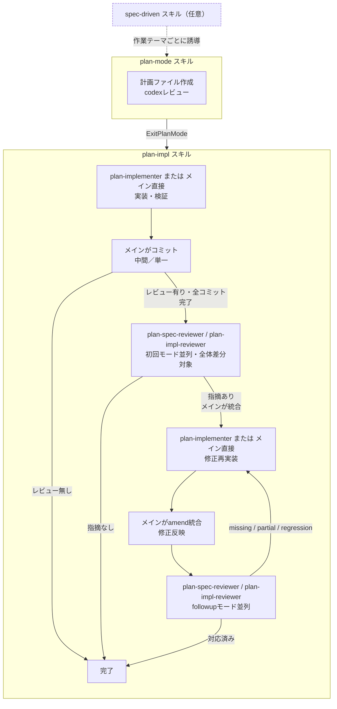

---
paths:
  - "agent-toolkit/**"
  - ".chezmoi-source/dot_claude/rules/agent-toolkit/**"
  - "~/.claude/rules/agent-toolkit/**"
  - ".claude-plugin/marketplace.json"
---

# Claude Codeプラグイン: agent-toolkit

本ファイルの対象読者はdotfiles編集者（本リポジトリやagent-toolkitを修正するコーディングエージェント）。

`agent-toolkit/`配下のファイルはClaude Codeのプラグイン`agent-toolkit`として配布される。
`.chezmoi-source/dot_claude/rules/agent-toolkit/`配下の配布ルールと共に利用される
（agent-toolkit利用者は本リポジトリのdotfiles利用者とは限らない）。

配布ルールとプラグインは標準のインストールルート（`install-claude.sh`／`install-claude.ps1`）で
同時に導入される。
プラグイン利用者は配布ルール（`~/.claude/rules/agent-toolkit/`）も導入済みである前提で記述してよい。
プラグイン本体に配布ルールと同等内容を重複記述する必要はない。

`~/.claude/rules/agent-toolkit/`は配布先であり、直接編集は不可。

バージョン更新・SSOT同期・ドキュメント同期は以下の手順で実施する。

## SSOTの2ファイル

以下の2箇所で`version`／`description`を完全に同一文字列に保つ。

- `agent-toolkit/.claude-plugin/plugin.json`
- `.claude-plugin/marketplace.json`の`plugins[]`内`name == "agent-toolkit"`のエントリ

整合性は`agent-toolkit/scripts/pretooluse_test.py`の`TestManifestSsot`が検査し、
`uvx pyfltr run`で自動的に失敗する。

## バージョン更新の判定基準

未bumpの場合、利用者に届く振る舞いが変わるものは必ずbumpする。

### bumpが必要な変更

- プラグインのhookスクリプトやentry pointのロジック変更
- 新しいcheck／機能の追加、既存checkの削除
- `hooks/hooks.json`など設定ファイルのmatcher／command変更
- 依存や実行環境要件の変更（`requires-python`／script headerのdependencies）
- ブロック条件の緩和（false positive対策でallowlistを増やす等）

### bumpが不要な変更

- コメント・docstringのみの修正
- `*_test.py`のみの追加・修正（SSOTテスト自身の変更を含む）
- 入出力が完全に不変なリファクタリング
- 誤字修正・スタイル調整

判断に迷う場合はbumpする方針とする（pre-1.0であれば頻繁にMINORを更新しても問題ない）。

### 未プッシュ範囲での統合運用

未プッシュコミットが既に1回以上bumpを含む場合、後続編集ごとに追加でbumpしない。
`scripts/agent_toolkit_bump.py`は既存bumpと同等以下の指定をno-op扱いするため、追加実行しても結果は変わらない。
複数回bumpを試みる代わりに既存bumpへ統合する形で運用する。
ただし既存bumpがPATCHで後続編集がMINOR相当の場合は`agent_toolkit_bump.py minor`で既存bumpを上書き格上げする。

### plan modeでの取り扱い

plan modeでの計画フェーズではbump要否や既存bumpとの差分を調査しない。
種別（PATCH/MINOR/MAJOR）のみ`### エージェント判断`へ記述し、
実装フェーズで`scripts/agent_toolkit_bump.py {種別}`を実行する。
ツール側で既存bumpとの統合を吸収するため、計画フェーズで`git log`を確認する必要は無い。

### PATCH／MINOR／MAJORの使い分け

- PATCH（`+0.0.1`）: 軽微な修正（メッセージ変更、スタイル調整、バグ修正、検出漏れの修正など）
- MINOR（`+0.1.0`）: 機能追加、検出範囲の大幅拡大、descriptionが変わる規模の変更など、規模の大きい変更に限定
- MAJOR（`+1.0.0`）: ユーザーからの明示的な指示がない限り行わない

## 同期先ドキュメント

`docs/guide/claude-code-guide.md`の「agent-toolkit」セクションに各プラグインのチェック内容要約がある。
以下の変更をしたときは当該セクションも併せて更新する。

- 新しいcheckの追加・既存checkの削除
- 検出範囲の大きな変更（allowlist／blocklistの方針変更）
- 依存ツールの変更（`uv`以外を要求するようになった等）
- 新しいプラグインを追加した場合（セクション追加が必要）

軽微な閾値調整やパターン追加など要約が変わらない範囲なら更新不要。

`README.md`本体には各プラグイン固有の記述がないため、通常は修正不要。

### install-claude.sh / install-claude.ps1 のファイルリスト

`install-claude.sh`の`FILES`と`install-claude.ps1`の`$files`は手動同期が必要。
`.chezmoi-source/dot_claude/rules/agent-toolkit/`配下を編集した場合は両ファイルを同期する。
ワンライナーインストーラーをGitHub API非依存で動かす方針のため自動同期手段は持たない。

## ファイル構成と参照方向

- `agent-toolkit/`配下のファイル分割（`agent.md`・`styles.md`など）は編集・レビュー時の見通し改善が目的。
  配布先の`~/.claude/rules/agent-toolkit/`では全ファイルが常時自動ロードされる
- 参照方向の許容範囲: dotfilesリポジトリ → プラグイン配布物、およびプラグイン配布物 ↔ 配布ルール
 （`~/.claude/rules/agent-toolkit/`）の参照は許容する。
  配布ルールは常時ロードされるためスキル側からのファイル名指定は省略可能だが、必須ではない
- 配布ルールは常時ロード、スキル本体は呼び出し時のみという責務分担を意識する
  - 配置先は「いつcontextへ読み込ませたいか」で判断する
  - 複数スキル・サブエージェント共通の一般論（`completed`制約・並列点検・`run_in_background`既定など）は配布ルールへ集約する
  - 特定スキル内でのみ使う運用指針は当該スキル側に残す

## スキル・エージェント開発

- SKILL.md本体に必要な情報は本体に直接書く。`references/`から別の`references/`を多段参照させない
 （Skillsのベストプラクティスに沿うため）
- サブエージェント間で共通する判断基準・制約は各エージェントに重複記述したまま維持する
 （別コンテキストで実行されるため、統合するとコンテキスト汚染や指示漏れが起きる）
- 並行する手順を別スキルに新設する際は、既存スキルの表記との整合を必ず確認する
- 「実行時エラーで判明する仕様（tool quirk）」「具体例」は再発リスクと影響度を踏まえて保持判断する
 （一過性で再発リスクの低いものは削除可）

スキル連携の概要（詳細は各SKILL.mdが正）:

- `spec-driven`（任意）: 大規模バージョンアップを想定した次版ドキュメント管理とワークフロー誘導
- `plan-mode`: 計画ファイルの作成・codexレビュー
- `plan-impl`: 計画合意後の計画実行。`レビュー方式: レビュー有り`の計画ではサブエージェントによる集約レビューも実施する

`spec-driven`が有効な場合は同スキルの誘導に従い、それ以外は直接`plan-mode`から始める。

## 配布物の制約

- 配布物（`agent-toolkit/`配下）の出力文字列・hookメッセージ・docstringには
  リポジトリ管理外の個人メモファイル名を含めない。
  検出対象は`scripts/claude_hook_pretooluse.py`の項目3が定義する
- 配布物（`agent-toolkit/`配下と`.chezmoi-source/dot_claude/rules/agent-toolkit/`配下）には、
  執筆者の手元プロジェクト固有の前提を断定的に書かない。
  特定設定値の採用状況・特定のディレクトリパス・「本リポジトリは〜」のような自指的表現を避け、
  条件付き表現（「`～`設定が有効な場合、」など）で書く

`plan-mode`が作成した計画ファイルは`ExitPlanMode`を合意ゲートとして通過する。
通過後は常に`plan-impl`スキルへ引き継ぐ。
計画ファイルの`レビュー方式`項目が`レビュー有り`の場合は集約レビュー工程も実施し、
`レビュー無し`の場合は実装・検証・コミットのみで完了する。
引き継ぎ時にコンテキストが途絶している前提で、計画ファイルが唯一の入力源として自立するよう漏れなく記述する。

## agent-toolkitのセッション状態フラグ

`agent-toolkit`プラグインのhookは、セッション単位の状態ファイルを介してPreToolUseとPostToolUse間で情報を共有する。
パスは`{tempdir}/claude-agent-toolkit-{session_id}.json`である。
パス規則の一般論は`agent-toolkit/skills/claude-code-standards/references/claude-hooks.md`の
「セッション状態ファイル」節を参照する。

フラグを追加・変更する際は本表を必ず更新し、書き込み元と読み取り元の対応関係を保つ。

- `test_executed` — PostToolUse(Bash)が記録。
  PreToolUse(Bash)の`git commit`未検証警告の抑制に使う
- `git_status_checked` — PostToolUse(Bash)が`git status` / `git log` / `git diff`を観測して記録
- `git_log_checked` — PostToolUse(Bash)が`git log`を観測して記録。
  PreToolUse(Bash)のamend / rebase直前確認に使う。
  commit / rebase / push / ファイル編集を観測した時点でリセットする
- `plan_mode_skill_invoked` — PostToolUse(Skill)が`agent-toolkit:plan-mode`呼び出しを観測して記録。
  PostToolUseのplan file形式検査の有効化、およびPreToolUseの最初ツール警告の抑制に使う
- `plan_mode_warning_emitted` — PreToolUseが最初ツール警告を発火済みかを記録（1セッション1回限り）

## 手順

1. 今回の変更が「バージョン更新の判定基準」に該当するか判定する
2. 該当する場合は`scripts/agent_toolkit_bump.py {patch|minor|major}`を実行する。
   未プッシュの既存bumpが指定種別と同等以上ならツールは何もせず、指定種別が上位なら既存bumpを上書きして格上げする
3. `description`を変更する場合はSSOT2ファイルを手で同期する
4. 必要なら`docs/guide/claude-code-guide.md`のチェック内容リストを更新する
5. `uvx pyfltr run-for-agent`を実行し、SSOTテストを含む全テストがgreenであることを確認する
6. 変更をコミットする（通常の編集と同じコミットに含めてよい）

push前にはbumpが必須である。
同じバージョンでは`claude plugin update`が「最新です」と返すため、bumpしないと利用者へ配信されない。

## 参考

- 利用者向け説明（チェック内容・更新手順）: `docs/guide/claude-code-guide.md`
- `agent-toolkit`の現行チェック内容: `agent-toolkit/scripts/pretooluse.py`モジュールdocstring
