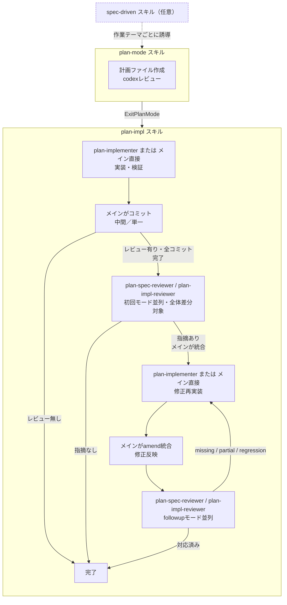

---
paths:
  - "agent-toolkit/**"
  - "~/.claude/rules/agent-toolkit/**"
  - ".claude-plugin/marketplace.json"
---

# agent-toolkit (Claude Codeルールファイル + プラグイン)

`agent-toolkit/`配下はClaude Codeプラグイン`agent-toolkit`として配布する。
ルールファイル（`~/.claude/rules/agent-toolkit/`）と併用される前提で、
プラグインにルールファイルと同等内容を書かない。

## ファイル構成と参照方向

編集対象と配置先は次の通り。

- `agent-toolkit/`配下: プラグイン（スキル・サブエージェント・フックスクリプト・marketplace記述）
- `agent-toolkit/rules/`配下: ルールファイル（`agent.md`・`styles.md`の2ファイル）
- `~/.claude/rules/agent-toolkit/`: ルールファイルの配布先。直接編集不可

参照方向はdotfilesリポジトリ→プラグイン、およびプラグイン↔ルールファイルを許容する。

配置先は「いつコンテキストへ読み込ませたいか」で判断する。

- 常時自動ロードしたい一般指針（`completed`制約・並列点検・`run_in_background`既定など）はルールファイルへ置く
- 特定タスクでのみ必要な指針はスキル本体（`agent-toolkit/skills/<name>/SKILL.md`）に残す

## 配布物としての記述方針

配布先の利用者は本リポジトリのdotfiles利用者とは限らない。
執筆者の手元プロジェクト固有の前提を断定的に書かない。

- 「本リポジトリは〜」「本プロジェクトでは〜」のような自指的な表現を避ける
- 特定設定値の採用を前提にした断定（例:「`shouldUsePoint: false`に設定しているため〜」）を避ける
- 特定のディレクトリパス・ファイル構成を前提とした断定を避ける
- 配布先環境で異なる可能性のある条件は条件付き表現（「`～`設定が有効な場合、」など）で書く
- 仕様参照としてのルール名・設定キー名・選択肢の説明は記述してよい

配布物の出力文字列・フックメッセージ・docstringにはリポジトリ管理外の個人メモファイル名を含めない。
検出対象は`scripts/claude_hook_pretooluse.py`の項目3が定義する。

スキル・サブエージェント編集時は次を守る。

- SKILL.md本体に必要な情報は本体に直接書く。`references/`から別の`references/`を多段参照させない
- サブエージェント間で共通する判断基準・制約は各エージェントに重複記述したまま維持する
 （別コンテキストで実行されるため、統合するとコンテキスト汚染や指示漏れが起きる）
- 並行する手順を別スキルに新設する際は、既存スキルの表記との整合を確認する
- 「実行時エラーで判明する仕様（tool quirk）」「具体例」は再発リスクと影響度を踏まえて保持判断する
 （一過性で再発リスクの低いものは削除可）

## スキル間の連携

`spec-driven`が有効な場合は同スキルの誘導に従い、無効な場合は`plan-mode`から始める。
`plan-mode`が作成した計画ファイルは`ExitPlanMode`を合意ゲートとして通過し、`plan-impl`スキルへ引き継ぐ。
計画ファイルの`レビュー方式`が`レビュー有り`の場合は集約レビュー工程を実施し、
`レビュー無し`の場合は実装・検証・コミットのみで完了する。
引き継ぎ時にコンテキストが途絶している前提で、計画ファイルが唯一の入力源として自立するよう漏れなく記述する。

## バージョン更新

### SSOTの2ファイル

`version`／`description`を以下2箇所で完全に同一文字列に保つ。

- `agent-toolkit/.claude-plugin/plugin.json`
- `.claude-plugin/marketplace.json`の`plugins[]`内`name == "agent-toolkit"`のエントリ

整合性は`agent-toolkit/scripts/pretooluse_test.py`の`TestManifestSsot`が検査し、
`uvx pyfltr run`で自動的に失敗する。

### 判定基準

利用者に届く振る舞いが変わるものは必ずbumpする。

- bumpが必要: フックスクリプト・entry pointロジック変更／checkの追加・削除／
  `hooks/hooks.json`の`matcher`・`command`変更／依存・実行環境要件の変更／allowlistなどブロック条件の変更
- bumpが不要: コメント・docstringのみ／`*_test.py`のみ／入出力が不変なリファクタリング／誤字・スタイル調整

判断に迷う場合はbumpする方針とする（pre-1.0であれば頻繁にMINORを更新しても問題ない）。

種別の使い分けは次の通り。

- PATCH（`+0.0.1`）: 軽微な修正（メッセージ変更、スタイル調整、バグ修正、検出漏れの修正など）
- MINOR（`+0.1.0`）: 機能追加、検出範囲の大幅拡大、descriptionが変わる規模の変更など、規模の大きい変更に限定
- MAJOR（`+1.0.0`）: ユーザーからの明示的な指示がない限り行わない

### 未プッシュ範囲での統合

未プッシュコミットが既に1回以上bumpを含む場合、後続編集ごとに追加でbumpしない。
`scripts/agent_toolkit_bump.py`は既存bumpと同等以下の指定をno-op扱いするため、追加実行しても結果は変わらない。
既存bumpがPATCHで後続編集がMINOR相当の場合は`agent_toolkit_bump.py minor`で既存bumpを上書き格上げする。

### plan modeでの取り扱い

計画フェーズではbump要否や既存bumpとの差分を調査しない。
種別（PATCH／MINOR／MAJOR）のみ`### エージェント判断`へ記述し、
実装フェーズで`scripts/agent_toolkit_bump.py {種別}`を実行する。
ツール側で既存bumpとの統合を吸収するため、計画フェーズで`git log`を確認する必要はない。

## 同期先ドキュメント

### docs/guide/claude-code-guide.md

`docs/guide/claude-code-guide.md`の「agent-toolkit」セクションに各プラグインのチェック内容要約がある。
以下の変更時は当該セクションも併せて更新する。

- 新しいcheckの追加・既存checkの削除
- 検出範囲の大きな変更（allowlist／blocklistの方針変更）
- 依存ツールの変更（`uv`以外を要求するようになった等）
- 新しいプラグインを追加した場合（セクション追加が必要）

軽微な閾値調整やパターン追加など要約が変わらない範囲なら更新不要。

### install-claude.sh / install-claude.ps1

`install-claude.sh`の`FILES`と`install-claude.ps1`の`$files`は手動同期が必要。
`agent-toolkit/rules/`配下を編集した場合は両ファイルを同期する。
ワンライナーインストーラーをGitHub API非依存で動かす方針のため自動同期手段は持たない。

## セッション状態フラグ

`agent-toolkit`プラグインのフックは、セッション単位の状態ファイルを介してPreToolUseとPostToolUse間で情報を共有する。
パスは`{tempdir}/claude-agent-toolkit-{session_id}.json`である。
パス規則の一般論は`agent-toolkit/skills/claude-code-standards/references/claude-hooks.md`の
「セッション状態ファイル」節に従う。

フラグを追加・変更する際は本表を更新し、書き込み元と読み取り元の対応関係を保つ。

- `test_executed` — PostToolUse(Bash)が記録。
  PreToolUse(Bash)の`git commit`未検証警告の抑制に使う
- `git_status_checked` — PostToolUse(Bash)が`git status` / `git log` / `git diff`を観測して記録
- `git_log_checked` — PostToolUse(Bash)が`git log`を観測して記録。
  PreToolUse(Bash)のamend / rebase直前確認に使う。
  commit / rebase / push / ファイル編集を観測した時点でリセットする
- `plan_mode_skill_invoked` — PostToolUse(Skill)が`agent-toolkit:plan-mode`呼び出しを観測して記録。
  PostToolUseのplan file形式検査の有効化、およびPreToolUseの最初ツール警告の抑制に使う
- `plan_mode_warning_emitted` — PreToolUseが最初ツール警告を発火済みかを記録（1セッション1回限り）

## 編集手順

1. 今回の変更が「バージョン更新」の判定基準に該当するか判定する
2. 該当する場合は`scripts/agent_toolkit_bump.py {patch|minor|major}`を実行する。
   未プッシュの既存bumpが指定種別と同等以上ならツールは何もせず、指定種別が上位なら既存bumpを上書きして格上げする
3. `description`を変更する場合はSSOTの2ファイルを手で同期する
4. 必要なら`docs/guide/claude-code-guide.md`のチェック内容リストを更新する
5. `uvx pyfltr run-for-agent`を実行し、SSOTテストを含む全テストがgreenであることを確認する
6. 変更をコミットする（通常の編集と同じコミットに含めてよい）

push前にはbumpが必須である。
同じバージョンでは`claude plugin update`が「最新です」と返すため、bumpしないと利用者へ配信されない。

## 参考

- 現行チェック内容: `agent-toolkit/scripts/pretooluse.py`モジュールdocstring
