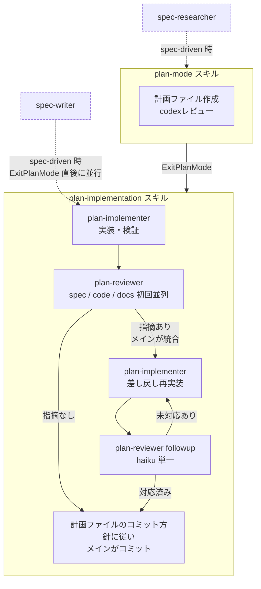

---
paths:
  - "plugins/**"
  - ".claude-plugin/marketplace.json"
---

# Claude Code plugin 編集チェックリスト

本リポジトリ配下の `plugins/` と `.claude-plugin/marketplace.json` を編集するときに確認する。
バージョン更新・SSOT同期・ドキュメント同期は漏れが発生しやすいため、本ファイルで手順を確認する。

## なぜ必要か

プラグインは `claude plugin update` 経由で配布される。
バージョン番号を上げない限り既存ユーザーへ更新は配信されない。
（同じバージョンでは `update` コマンドが「最新です」と返す）
過去に `agent-toolkit`（旧 `edit-guardrails`）で実害があったため、編集のたびにバージョン更新の要否を判定する。

また、バージョン情報はSSOT違反の状態で2ファイルに重複している。
片方だけ更新すると配布に失敗するため、必ず両方を同期する。

## SSOT の 2 ファイル

プラグインごとに以下の2箇所で `version` / `description` を完全に同一文字列に保つ。

- `plugins/<plugin-name>/.claude-plugin/plugin.json`
- `.claude-plugin/marketplace.json` の `plugins[]` 内 `name == "<plugin-name>"` のエントリ

整合性は各プラグインのテストで検査する。
`agent-toolkit`の担当は`TestManifestSsot`で、`uv run pyfltr run`で自動的に失敗する
（場所: `plugins/agent-toolkit/tests/pretooluse_test.py`）。
新しいプラグインを追加するときは同等のSSOTテストも追加する。

## 配布経路と反映タイミング

### directory型環境（chezmoi管理下の作者環境）での運用

chezmoi管理下のマシンでは、marketplace登録がdirectory型（dotfilesリポジトリ直接参照）になっている。
このため、「dotfilesで編集 → `chezmoi apply` → Claude Code再起動または `/reload-plugins`」のワークフローで
編集内容が即時反映される。version bumpは不要。

技術的な背景:

- `chezmoi apply` 後処理が `plugin install` を毎回再実行し、dotfilesからキャッシュへ同期する
- `plugin update` はバージョン一致時no-op（directory型でのキャッシュ同期に使えない）
- `claude plugin marketplace update` はvalidationのみでキャッシュ同期しない
- `/reload-plugins` は現在起動中のClaude Codeセッションで読み込んでいるhook・skill・agentを再読み込みする

### install-claude経由で入った利用者への配布

`install-claude.sh`/`install-claude.ps1` 経由で入った利用者（chezmoi未使用）はGitHub型を使う。
この環境では従来通りversion bumpして `marketplace.json` に反映したうえで、利用者がインストールコマンドを
再実行するか `claude plugin update` で更新を受け取る。

## バージョン更新が必要な変更

directory型環境（chezmoi管理下の作者環境）ではversion bumpなしで編集を反映できる（前節参照）。
ここで述べるバージョン更新は他者配布向け（`install-claude` 経由で入った利用者への配布サイクル上）の操作である。

プラグイン編集に着手する前に、まず未プッシュコミットでバージョンが既に更新済みか確認する（後述の「手順」参照）。
更新済みであれば、追加の変更で再度bumpする必要はなく、以降の判定はスキップしてよい。

未更新の場合、ユーザーに届く振る舞いが変わるものは必ずバージョンを更新する。
具体的には以下のいずれかに該当する場合。

- プラグインのhookスクリプトやentry pointのロジック変更
- 新しいcheck / 機能の追加、既存checkの削除
- `hooks/hooks.json` など設定ファイルのmatcher / command変更
- 依存や実行環境要件の変更（`requires-python` / script headerのdependencies）
- ブロック条件の緩和（false positive対策でallowlistを増やす等）

## バージョン更新が不要な変更

- コメント・docstringのみの修正
- `tests/` のみの追加・修正（SSOTテスト自身の変更を含む）
- 入出力が完全に不変なリファクタリング
- 誤字修正・スタイル調整

判断に迷う場合はバージョンを更新する方針とする（pre-1.0であれば頻繁にMINORを更新しても問題ない）。

## バージョン更新指針

- PATCH（`+0.0.1`）: 軽微な修正（メッセージ変更、スタイル調整、バグ修正、検出漏れの修正など）
- MINOR（`+0.1.0`）: 機能追加、検出範囲の大幅拡大、descriptionが変わる規模の変更など、規模の大きい変更に限定
- MAJOR（`+1.0.0`）: ユーザーからの明示的な指示がない限り行わない

## 同期先ドキュメント

`docs/guide/claude-code-guide.md` の「agent-toolkit」セクションに各プラグインのチェック内容要約がある。
以下の変更をしたときはここも併せて更新する（更新忘れが起きやすいのでここに明記する）。

- 新しいcheckの追加・既存checkの削除
- 検出範囲の大きな変更（allowlist / blocklistの方針変更）
- 依存ツールの変更（`uv` 以外を要求するようになった等）
- 新しいプラグインを追加した場合（セクション追加が必要）

軽微な閾値調整やパターン追加など要約が変わらない範囲なら更新不要。

配布方式自体（chezmoi自動インストール / marketplace経由など）を変えた場合は `docs/guide/claude-code.md` 側の修正も必要。
`README.md` 本体には各プラグイン固有の記述がないため、通常は修正不要。

## 手順

1. 未プッシュコミットで対象プラグインの `version` が既に更新されているかを以下のコマンドで確認する

    ```bash
    git log --decorate -p '@{upstream}..HEAD' -- plugins/<plugin-name>/.claude-plugin/plugin.json
    ```

    差分があれば更新済みのため再bump不要、なければ判定基準（前節「バージョン更新が必要な変更」参照）に従って更新する

2. 必要に応じて `plugins/<plugin-name>/.claude-plugin/plugin.json` の `version`（および `description`）を更新
3. `.claude-plugin/marketplace.json` の該当プラグイン エントリを同一文字列に同期する
4. 必要なら `docs/guide/claude-code-guide.md` のチェック内容リストを更新
5. `uv run pyfltr run-for-agent` を実行し、SSOTテストを含む全テストがgreenであることを確認
6. 変更をコミット（通常の編集と同じコミットに含めてよい）

## 計画・実装系スキルの連携

計画モードで開始すると`plan-mode`スキルが呼ばれ、計画ファイルを作成してcodexレビューで仕上げる。
`ExitPlanMode`を合意ゲートとして通過すると、`plan-implementation`スキルへ引き継ぐ。
このときコンテキストがクリアされている可能性があるため、計画ファイルが唯一の入力源として自立するよう書き切っておく。

`plan-implementation`スキルはタスク分解から実装・検証・レビュー・コミットまでを取り仕切る。
メインは一切手を動かさず、実装と検証は`plan-implementer`サブエージェントへ、
レビューは`plan-reviewer`サブエージェントへ委譲する。
初回レビューでは`spec`（仕様適合性）・`code`（コード品質）・`docs`（ドキュメント品質）の3種別を同一メッセージ内で並列起動し、
指摘を出し切る。
メインは各サブエージェントの戻り値本文から指摘を統合し、`plan-implementer`差し戻しプロンプトに直接埋め込む。
差し戻し後の再レビューは`plan-reviewer`の`followup`種別を`haiku`単一起動し、前回指摘への対応状況のみを確認する。
指摘ゼロに達した時点で、計画ファイルの「コミット方針」に従ってメインがコミットする。
メインの責務は進行管理・指摘統合・ユーザー確認・コミット・pushに絞り、コンテキスト汚染を避ける。

`spec-driven`を手動トリガーした場合は、前後にこのワークフローの外周が付く。
plan modeに入る前に`spec-researcher`で既存機能を並列調査し、
`ExitPlanMode`直後に`spec-writer`を`plan-implementer`と並行起動して作業版ドキュメントの骨子を立ち上げる。
その後の実装・検証・レビュー・コミットは`plan-implementation`スキルへ一任するため分岐は設けない。



## 参考

- 配布方式と前提: `docs/guide/claude-code.md` のagent-toolkitセクション
- 利用者向け説明（チェック内容・更新手順）: `docs/guide/claude-code-guide.md`
- `agent-toolkit` の現行チェック内容: `plugins/agent-toolkit/scripts/pretooluse.py` モジュールdocstring
