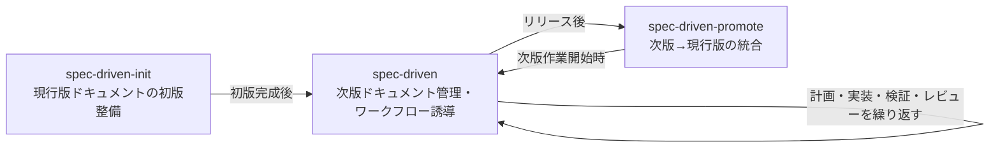

# spec-driven導入ワークフロー

本スキルはspec-driven系ワークフローの最初のステップであり、
現行版ドキュメントが未整備のプロジェクトで1回だけ実行する。

## ワークフロー全体像

配置先はプロジェクト指定があればそれを採用し、無ければ規模・性質に応じて決定する。

## 参照ファイル

- `agent-toolkit:spec-driven`の`references/spec-driven-framework.md`: 用語定義・配置規約（手順1で読み込む）
- `references/doc-layout-samples.md`: 現行版ドキュメント構成サンプル（手順2で参照する）

## 手順

1. `agent-toolkit:spec-driven`スキルと`references/spec-driven-framework.md`を呼び出し、用語・配置規約・テンプレートを確認する
2. 現行版ドキュメントの構成を確定する。
   プロジェクト指定（`CLAUDE.md`等での明示）があればそれを採用する。
   無ければ`references/doc-layout-samples.md`を読み込み、サンプルを参考にユーザーと協議して構成を決定する
3. 確定した構成を`CLAUDE.md`へ記録する。
   配置ディレクトリ・ファイル種別（機能ドキュメント・横断ドキュメント等）・命名規則を残し、
   以降のセッションが参照できる形にする
4. 既存コードと既存ドキュメントを確認する。
   背景・スコープ・設計判断などに関する情報が不足する場合は、推測で進めず先にユーザーへ確認する
5. 確定構成のファイル種別ごとに、初版で起こすドキュメントの候補を整理する（暫定で可）
6. ユーザーとドキュメント単位を合意する。合意が得られるまで手順7以降に進まない
7. 合意した単位で、確定構成のディレクトリ・命名規則に従ってドキュメントファイルを作成する
8. コード中の参照コメントを現行版ドキュメントのパスへ書き換える
9. リンクと参照コメントの指し先を検証する

## 方針

- ドキュメント単位は利用者視点の機能を基準に決める
- 複数機能で共有される共通仕様（例: 利用者から確認できるリトライ可否ポリシー、
  共通エラー応答仕様、複数機能で参照される共通データ型の制約や用語など）は
  確定構成の横断ドキュメントへ置く。
  単一機能内で閉じる仕様はその機能ドキュメント内に書く
- 既存資料から背景、スコープ、受け入れ基準、主要設計判断、却下した代替案を抽出する
- 本スキルは現行版ドキュメントの初版整備のみを担当する。`docs/v{next}/`配下は`agent-toolkit:spec-driven`スキルの担当
