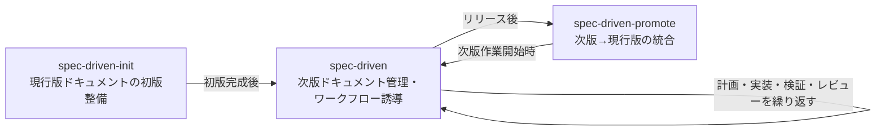

# 軽量SDDワークフロー

本スキルは、次期リリースの仕様と設計判断を次版ドキュメントへ集約し、
リリース後に現行版ドキュメントへ統合するための管理手順である。

## ワークフロー全体像

spec-driven系3スキルの関係:

本スキルは「次版ドキュメント管理・ワークフロー誘導」を担う。
「次版」は複数の作業テーマ（機能追加・改修）を持つ。

ユーザーが入力した要件をもとに、初めに次版ドキュメントを一式作成する。
その後、複数回の計画・実装・検証・レビューを経て次版の完成を目指す。
次版のリリース後、`agent-toolkit:spec-driven-promote`スキルにより現行版ドキュメントへ統合する。

計画・実装・検証・レビュー自体は`agent-toolkit:plan-mode`と`agent-toolkit:careful-impl`に委譲することとし、
本スキルではドキュメントの管理とワークフローのガイドを担当する。

現行版ドキュメントが未整備のプロジェクトでは、先に`agent-toolkit:spec-driven-init`スキルを呼び出す。

## 参照コメント運用

ドキュメントとコードの乖離を防ぐため、コードに適宜参照コメントを記述する。

- 次版の実装時には、いったん次版ドキュメントへの参照コメントを追加する
- ドキュメント統合時は参照コメントを更新する

## 参照ファイル

- `references/spec-driven-framework.md`: 用語定義・配置規約・現行版ドキュメントの記述レベル（本スキルに先立って読み込む）
- `references/templates.md`: ドキュメント書式（プロジェクトで書式指定が無い場合に使用する）

## ワークフロー

作業は1つのセッションでは完了しない前提とし、
次版総合ドキュメントに状況を記録しながら進める。

### 1. 次版ドキュメントの作成

以下の情報を確認し、次版ドキュメントを作成する。

- 作業テーマ名
- 次期バージョン
- 新規追加または既存改修の区分
- 目的、成功条件、スコープ
- 関連する現行版ドキュメント

ユーザーから与えられた情報で判断できない部分は、選択肢を提示してユーザーが選択する形で進めていく。

1つのセッションで完了するとは限らないため、
進捗状況を次版総合ドキュメントに記録しながら進める。

### 2. 計画・実装・検証・レビュー

`agent-toolkit:plan-mode`スキルを呼び出し、計画ファイル作成とそれ以降の作業を進める。

計画ファイルには、コード変更だけでなく、以下の項目も必ず含める。

- コードへの次版ドキュメントへの参照コメントの追加（主要箇所に適宜）
- 次版ドキュメントの詳細化
- 現行版ドキュメントおよび次版総合ドキュメントの更新

計画時に行われた設計判断や却下した代替案などは
次版ドキュメントへ追記する計画とする。

### 中断・再開

次版総合ドキュメントを確認し、次に行うべき作業を特定する。
複数の作業テーマが同時進行している場合は、各テーマの状態を整理したうえで
どのテーマを優先するかをユーザーに確認する。
ドキュメント骨子（背景・スコープ・受け入れ基準）が未完成のテーマは、
`agent-toolkit:plan-mode`を呼ぶ前に骨子の完成を優先する。
計画・実装段階に入る前提条件を欠いたまま計画ファイルを作っても精度が出ないためである。
