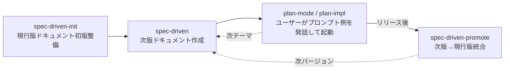

# 軽量SDDワークフロー

次期リリースの仕様と設計判断を次版ドキュメントへ集約する。
「次版」は複数の作業テーマ（機能追加・改修）を持つ。
本スキルは作業テーマごとに次版ドキュメントを作成し、実装誘導のプロンプト例を出力して終了する。
実装はユーザーが当該プロンプトを発話して別経路で起動する。
設計判断とその根拠は、将来の修正・拡張時に判断材料として参照される前提で記録する。

## ワークフロー全体像

spec-driven系3スキルの関係:

現行版ドキュメントが未整備のプロジェクトでは、先に`agent-toolkit:spec-driven-init`スキルを呼び出す。
次版リリース後は`agent-toolkit:spec-driven-promote`スキルで現行版ドキュメントへ統合する。

## 参照ファイル

- `references/spec-driven-framework.md`: 用語定義・配置規約・現行版ドキュメントの記述レベル（ワークフロー開始前に読み込む）
- `references/templates.md`: ドキュメント書式（プロジェクトで書式指定が無い場合に使用する）

## ワークフロー

### 1. 次版ドキュメントの作成

以下の情報を確認し、次版ドキュメントを作成する。

- 作業テーマ名
- 次期バージョン
- 新規追加または既存改修の区分
- 目的、成功条件、スコープ
- 関連する現行版ドキュメント

ユーザーから与えられた情報で判断できない部分は、選択肢を提示してユーザーが選択する形で進める。

次版ドキュメントの配置先は`CLAUDE.md`の記録があればそれを採用する。
記録が無い場合は`references/spec-driven-framework.md`の既定（`docs/v{next}/`配下）を使用する。
既定と異なる配置をプロジェクトで採用する場合は、本工程内で`CLAUDE.md`へ追記する。

### 2. 実装誘導プロンプトの出力

次版ドキュメントの作成完了後、以下の形式でプロンプト例をユーザーへ提示して本スキルを終了する。
プロンプト例の本文には、ワークフロー1で確定した次版ドキュメントおよび次版総合ドキュメントの実パスを埋め込む。
既定配置を採用した場合は`docs/v{next}/{作業テーマ名}.md`と`docs/v{next}/OVERVIEW.md`を使用する。
プロジェクト固有配置を採用した場合はその実パスを使用する。
ユーザーが当該プロンプトを発話すると`agent-toolkit:plan-mode`が起動し、実装フェーズへ引き継がれる。

実装に進む場合のプロンプト例
（`<作業テーマドキュメントパス>`・`<次版総合ドキュメントパス>`はワークフロー1で確定した実パスへ置換）:

> `<作業テーマドキュメントパス>`を実装してください。
> 実装時は次を守ってください。
>
> - コード主要箇所に当該ドキュメントへの参照コメントを追加する
> - 計画時の設計判断と却下した代替案を当該ドキュメントへ追記する
> - 実装に合わせて現行版ドキュメントと次版総合ドキュメント（`<次版総合ドキュメントパス>`）を更新する
