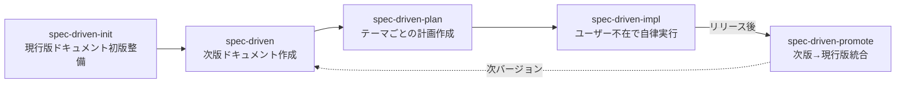

# 軽量SDDワークフロー

次期リリースの仕様と設計判断を次版ドキュメントへ集約する。
「次版」は複数の作業テーマ（機能追加・改修）を持つ。
本スキルは作業テーマごとに次版ドキュメントを作成し、次工程`spec-driven-plan`への誘導プロンプト例を出力して終了する。
計画作成と実装はユーザーが当該プロンプトを発話して別経路で起動する。
設計判断とその根拠は、将来の修正・拡張時に判断材料として参照される前提で記録する。

## ワークフロー全体像

spec-driven系スキルの関係:

現行版ドキュメントが未整備のプロジェクトでは、先に`agent-toolkit:spec-driven-init`スキルを呼び出す。
次版リリース後は`agent-toolkit:spec-driven-promote`スキルで現行版ドキュメントへ統合する。

## 参照ファイル

- `references/spec-driven-framework.md`: 用語定義・配置規約・現行版ドキュメントの記述レベル（ワークフロー開始前に読み込む）
- `references/templates.md`: ドキュメント書式（プロジェクトで書式指定が無い場合に使用する）

## ワークフロー

### 1. 次版ドキュメントの作成

以下の情報を確認し、次版ドキュメントを作成する。

- 作業テーマ名
- 次期バージョン
- 新規追加または既存改修の区分
- 目的、成功条件、スコープ
- 関連する現行版ドキュメント

ユーザーから与えられた情報で判断できない部分は、選択肢を提示してユーザーが選択する形で進める。

次版ドキュメントの配置先は`CLAUDE.md`の記録があればそれを採用する。
記録が無い場合は`references/spec-driven-framework.md`の既定（`docs/v{next}/`配下）を使用する。
既定と異なる配置をプロジェクトで採用する場合は、本工程内で`CLAUDE.md`へ追記する。

### 2. 計画作成誘導プロンプトの出力

次版ドキュメントの作成完了後、以下のプロンプト例をユーザーへ提示して本スキルを終了する。
ユーザーが当該プロンプトを発話すると`agent-toolkit:spec-driven-plan`が起動し、計画作成フェーズへ引き継がれる。

> `agent-toolkit:spec-driven-plan`スキルを起動してください。
