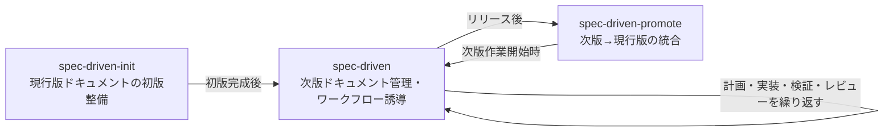

# spec-drivenフレームワーク共通定義

spec-driven系スキル（`spec-driven`・`spec-driven-init`・`spec-driven-promote`）で共有する用語定義と配置規約。

## ワークフロー全体像

- `spec-driven-init`: 現行版ドキュメントが未整備のプロジェクトで最初に1回だけ使う
- `spec-driven`: 次版ドキュメントの作成から計画・実装・検証・レビューの繰り返しを担う
- `spec-driven-promote`: リリース後に次版ドキュメントを現行版へ統合するときに使う

## 用語定義

- 現行版ドキュメント: リリース済み機能の最新仕様
  - 機能ドキュメント: 現行版ドキュメントのうち、個々の機能の仕様を記述したドキュメント
  - 横断ドキュメント: 現行版ドキュメントのうち、複数機能に跨る共通事項や、
    個々の機能ドキュメントに含まれない補足事項を記述したドキュメント
- 次版ドキュメント: 次期リリース作業中の仕様
  - 次版総合ドキュメント: 作業テーマ別進捗と次に行うべき作業を記録する単一ドキュメント（`docs/v{next}/OVERVIEW.md`）
  - 作業テーマドキュメント: 次版ドキュメントのうち、個々の作業テーマに対応するドキュメント
- 作業テーマ: 今回のリリースで加える変更の単位。例: `SSO追加`
- 次期バージョン: 次期リリースのバージョン番号。例: `v3`、`v1.2`、`v2026-04-18`
- 利用者: 対象システムを呼び出す側。
  ライブラリなら呼び出し元コード（アプリ開発者）、CLIなら操作ユーザー、
  サービスならAPIクライアントを指す。ライブラリ/ツールの内部実装者は含まない

次版横断ドキュメントという独立分類は設けない。横断性のある変更は作業テーマドキュメントとして記述する。

## 現行版ドキュメントの記述レベル

現行版ドキュメント（機能ドキュメント・横断ドキュメント）は、外部仕様レベルで記述する。
利用者が読んで理解できる、外から見たspecに限定する。

- 書くもの: 利用者から確認できる振る舞い、入出力の仕様、利用条件・制約、
  設計判断のうち外部仕様の選択理由
- 書かないもの: 内部実装の構造、クラス・関数・変数名、ファイルパス、モジュール分割、
  内部データ構造などの実装詳細

次版ドキュメント（`docs/v{next}/`配下）には本ルールを適用しない。
実装中の議論は内部詳細を含めて記録してよい。
ただし`spec-driven-promote`での統合時に、現行版へ持ち込む内容を外部仕様レベルへ整理する。

## 配置規約

配置先はプロジェクト指定があればそれを採用し、`CLAUDE.md`に記録する。
プロジェクト指定が無い場合の既定:

- 現行版ドキュメント:
  - `docs/features/{機能名}.md` — 機能ドキュメント
  - `docs/topics/{トピック名}.md` — 横断ドキュメント
- 次版ドキュメント:
  - `docs/v{next}/OVERVIEW.md` — 次版総合ドキュメント
  - `docs/v{next}/{作業テーマ名}.md` — 作業テーマドキュメント
